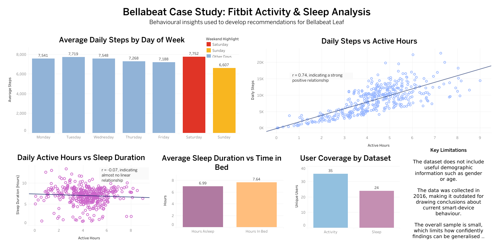

# Bellabeat Smart Device Analysis

## Project Overview

This case study analyses Fitbit smart-device activity and sleep data
to identify consumer behaviour trends and develop recommendations
for Bellabeat Leaf.

## Business Task

Analyse non-Bellabeat smart-device usage data and use the findings
to provide marketing recommendations for Bellabeat.

## Tools Used

- Excel
- Python
- Pandas
- Tableau
- PowerPoint

## Key Findings

- Average daily steps were highest on Saturday and lowest on Sunday.
- Daily active hours and steps showed a strong positive correlation (r = 0.74).
- Daily active hours showed almost no linear relationship with sleep duration (r = -0.07).
- Users averaged approximately 7 hours of sleep.
- Sleep data covered fewer users than activity data.

## Recommendations

1. Gamify movement through Leaf and the Bellabeat app.
2. Use personalised prompts on lower-activity days.
3. Treat activity and sleep as separate wellness behaviours.

## Dashboard

## Project Files

- [Jupyter Notebook](bellabeat_process.ipynb) — full cleaning and analysis workflow
- [Presentation](Bellabeat_Case_Study_Presentation.pdf) — final stakeholder presentation
- [Dashboard](bellabeat_dashboard.png) — Tableau dashboard used to summarise findings
